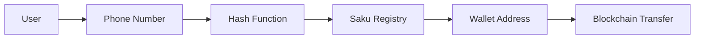

<p align="center">
  
</p>

# Saku

Send crypto with phone numbers. No wallet addresses needed.

A modern crypto wallet application built on Arbitrum that simplifies Web3 transactions by mapping phone numbers to wallet addresses. Making crypto payments as intuitive as traditional messaging apps.

[Smart Contracts](https://github.com/riyqnn/sc-saku)

---

## What is Saku?

Saku eliminates the complexity of cryptocurrency transfers. Instead of copying long wallet addresses, users simply send crypto to phone numbers. Behind the scenes, phone numbers are cryptographically mapped to on-chain wallet addresses through the Saku Registry smart contract.

---

## Features

### Core Functionality

**Phone-Based Transfers** - Send cryptocurrency using phone numbers instead of complex wallet addresses

**Easy Top-Up** - Add funds through deposit or top-up

**Split Bills** - Divide payments among multiple recipients effortlessly

**QR Payments** - Generate and scan QR codes for instant transactions

**Packet System** - Send and receive gift packets with crypto

**Transaction History** - Track all crypto activities in one place

### Technical Features

**Smart Contract Integration** - Interacts with Saku Registry on Arbitrum Sepolia for phone-to-address mapping

**Secure Authentication** - JWT-based system with OTP verification via WhatsApp

**Real-Time Updates** - Supabase-powered database with instant balance and transaction updates

**Farcaster Integration** - Built as a mini-app for social crypto payments

---

## Quick Start

### Prerequisites

- Node.js 18+ and pnpm
- A Supabase project
- Arbitrum Sepolia RPC endpoint

### Installation

```bash
# Clone the repository
git clone https://github.com/riyqnn/saku.git
cd saku

# Install dependencies
pnpm install

# Configure environment variables
cp .env.local.example .env
# Edit .env with your configuration

# Run development server
pnpm dev
```

Open [http://localhost:3000](http://localhost:3000) to view the application.

### Environment Variables

```bash
# Supabase Configuration
NEXT_PUBLIC_SUPABASE_URL=your_supabase_url
NEXT_PUBLIC_SUPABASE_ANON_KEY=your_supabase_anon_key

# Blockchain Configuration
NEXT_PUBLIC_RPC_URL=https://sepolia-rollup.arbitrum.io/rpc
NEXT_PUBLIC_SAKU_REGISTRY_ADDRESS=0xFf3157D1BE69e88F40eb105d222344b10Caa25A1
NEXT_PUBLIC_IDRX_ADDRESS=your_idrx_token_address
ADMIN_PRIVATE_KEY=your_admin_private_key
```

---

## Architecture

### Project Structure

```
saku/
├── app/
│   ├── api/              # API routes (auth, transfers, payments, packets, staking)
│   ├── home/             # Main dashboard
│   ├── deposit/          # Deposit funds
│   ├── withdraw/         # Withdraw funds
│   ├── topup/            # Top-up functionality
│   ├── transfer/         # Send crypto
│   ├── pay/              # Payment interface
│   ├── split-bill/       # Bill splitting
│   ├── packet/           # Packet system (create, claim)
│   ├── staking/          # Staking interface
│   ├── transactions/     # Transaction history
│   ├── profile/          # User settings
│   └── notifications/    # Notifications center
├── components/           # Reusable UI components
├── lib/
│   ├── config.ts         # Network & contract config
│   ├── supabase/         # Database client
│   └── utils/            # Helper functions
└── contracts/            # Smart contract artifacts
```

### Key Components

| Component | Description |
|-----------|-------------|
| **SakuRegistry** | Maps phone numbers to wallet addresses on-chain |
| **Packet System** | Send and receive gift packets with crypto |
| **Wallet SDK** | Ethers.js for blockchain interactions |
| **Auth System** | JWT + OTP verification via WhatsApp |
| **Staking System** | Earn rewards through staking |

### Data Flow



---

## Tech Stack

### Frontend
| Technology | Purpose |
|------------|---------|
| [Next.js 16](https://nextjs.org) | React framework with App Router |
| [TypeScript](https://www.typescriptlang.org) | Type-safe JavaScript |
| [Tailwind CSS](https://tailwindcss.com) | Utility-first styling |
| [Radix UI](https://www.radix-ui.com) | Accessible component primitives |
| [Lucide Icons](https://lucide.dev) | Beautiful icon set |

### Backend & Database
| Technology | Purpose |
|------------|---------|
| [Supabase](https://supabase.com) | PostgreSQL database & auth |
| [Next.js API Routes](https://nextjs.org/docs/api-routes/introduction) | Serverless endpoints |
| [Firebase Admin](https://firebase.google.com/docs/admin) | Push notifications |

### Blockchain & Payments
| Technology | Purpose |
|------------|---------|
| [Ethers.js v6](https://docs.ethers.org) | Web3 interactions |
| [Arbitrum Sepolia](https://sepolia.arbitrum.io) | Testnet deployment |
| [QRCode.react](https://github.com/zpao/qrcode.react) | QR code generation |

### Additional Tools
- [Farcaster Mini-App SDK](https://github.com/farcasterxyz/minikit) - Social integration
- [Recharts](https://recharts.org) - Data visualization
- [AOS](https://michalsnik.github.io/aos) - Scroll animations
- [Zod](https://zod.dev) - Schema validation

---

## App Routes

| Route | Description |
|-------|-------------|
| `/` | Landing page |
| `/get-started` | Onboarding flow |
| `/home` | Main dashboard |
| `/deposit` | Deposit funds into wallet |
| `/withdraw` | Withdraw funds from wallet |
| `/topup` | Top-up functionality |
| `/transfer` | Send to phone number or address |
| `/pay` | Payment interface |
| `/split-bill` | Split payments with others |
| `/split-bill/details/[id]` | View split bill details |
| `/split-bill/history` | Split bill history |
| `/split-bill/edit/[id]` | Edit split bill |
| `/packet/create` | Create new packets |
| `/packet/claim/[code]` | Claim packets with code |
| `/staking` | Staking interface |
| `/transactions` | Transaction history |
| `/profile` | User settings |
| `/notifications` | Notifications center |

---

## Configuration

### Network Settings

Default network is **Arbitrum Sepolia** (Chain ID: 421614). Configure in `lib/config.ts`:

```typescript
export const NETWORK_CONFIG = {
  chainId: 421614,
  name: "Arbitrum Sepolia",
  rpcUrl: "https://sepolia-rollup.arbitrum.io/rpc",
  blockExplorer: "https://sepolia.arbiscan.io",
};
```

### Smart Contract

**SakuRegistry** deployed at: `0xeB94353ccdD59f491262059039B7Fb7A91CBD3226`

```solidity
// contracts/saku.sol
contract SakuRegistry {
  mapping(address => string) public addressToPhone;
  mapping(string => address) public phoneToAddress;
}
```

For smart contract source code and deployment details, visit the [Smart Contract Repository](https://github.com/riyqnn/sc-saku).

---

## Contributing

We welcome contributions! Please see our [Contributing Guide](CONTRIBUTING.md) for details.

1. Fork the repository
2. Create your feature branch (`git checkout -b feature/amazing-feature`)
3. Commit your changes (`git commit -m 'Add amazing feature'`)
4. Push to the branch (`git push origin feature/amazing-feature`)
5. Open a Pull Request

---

## License

This project is licensed under the MIT License - see the [LICENSE](LICENSE) file for details.

---

## Acknowledgments

- Built with [Next.js](https://nextjs.org)
- Smart contracts deployed on [Arbitrum](https://arbitrum.io)
- UI components from [Radix UI](https://www.radix-ui.com)
- Icons by [Lucide](https://lucide.dev)

---

**[Documentation](https://github.com/riyqnn/saku/wiki)** - **[Report Bug](https://github.com/riyqnn/saku/issues)** - **[Request Feature](https://github.com/riyqnn/saku/issues)**
